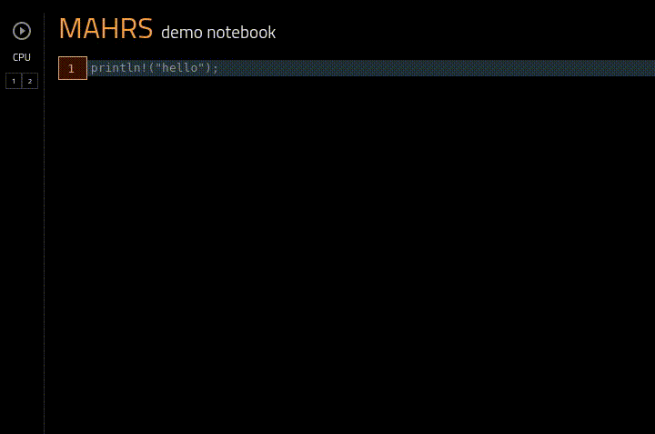

# ＭＡＨＲＳ

A data science notebook for Rust.

* a full Rust context based off [evxcr](https://github.com/google/evcxr) 
* single binary



# Installation

Mahrs runs on a server on your machine. Running its binary will start the server and open up a browser to the tool.

```
cargo install mahrs
mahrs
```

# License

This project is licensed under either of

 * Apache License, Version 2.0, ([LICENSE-APACHE](LICENSE-APACHE) or
   http://www.apache.org/licenses/LICENSE-2.0)
 * MIT license ([LICENSE-MIT](LICENSE-MIT) or
   http://opensource.org/licenses/MIT)

at your option.


### Contribution

Unless you explicitly state otherwise, any contribution intentionally submitted
for inclusion in `mahrs` by you, as defined in the Apache-2.0 license, shall be
dual licensed as above, without any additional terms or conditions.
