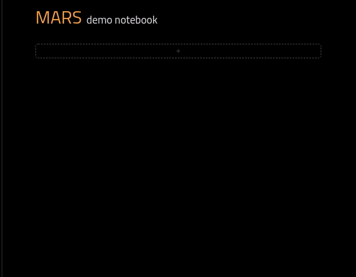
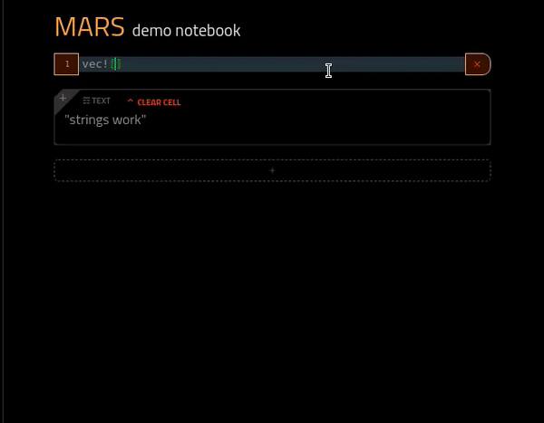

# ＭＡＲＳ

A data science notebook for Rust.

* a full Rust context based off [evxcr](https://github.com/google/evcxr) 
* Can dynamically loading dependencies using evxcr `:dep` command (e.g. `:dep random`)
* single binary




# Installation

Mars runs on a server on your machine. Running its binary will start the server and open up a browser to the tool.

```
cargo install mars
mars
```

# Examples

Getting a random number

```rust
:dep rand
use rand::Rng;

let mut rng = rand::thread_rng();

let n1: u8 = rng.gen();
let n2: u16 = rng.gen();
println!("Random u8: {}", n1);
println!("Random u16: {}", n2);
println!("Random u32: {}", rng.gen::<u32>());
println!("Random i32: {}", rng.gen::<i32>());
println!("Random float: {}", rng.gen::<f64>());
```

Showing some markdown

```rust
%%markdown
# Title

Text 
* item 1
* item 2
```

Showing some HTML.  Anything that evaluates to a json string in this format will render HTML instead.

```rust
r#"{"html":"<b>some html</b>"}"#
```

Showing some image.  Anything that evaluates to a json string in this format will render an image instead. Base64 images work too.

```rust
r#"{"image":"https://some.com/image.png"}"#
```


# License

This project is licensed under either of

 * Apache License, Version 2.0, ([LICENSE-APACHE](LICENSE-APACHE) or
   http://www.apache.org/licenses/LICENSE-2.0)
 * MIT license ([LICENSE-MIT](LICENSE-MIT) or
   http://opensource.org/licenses/MIT)

at your option.


### Contribution

Unless you explicitly state otherwise, any contribution intentionally submitted
for inclusion in `mars` by you, as defined in the Apache-2.0 license, shall be
dual licensed as above, without any additional terms or conditions.
